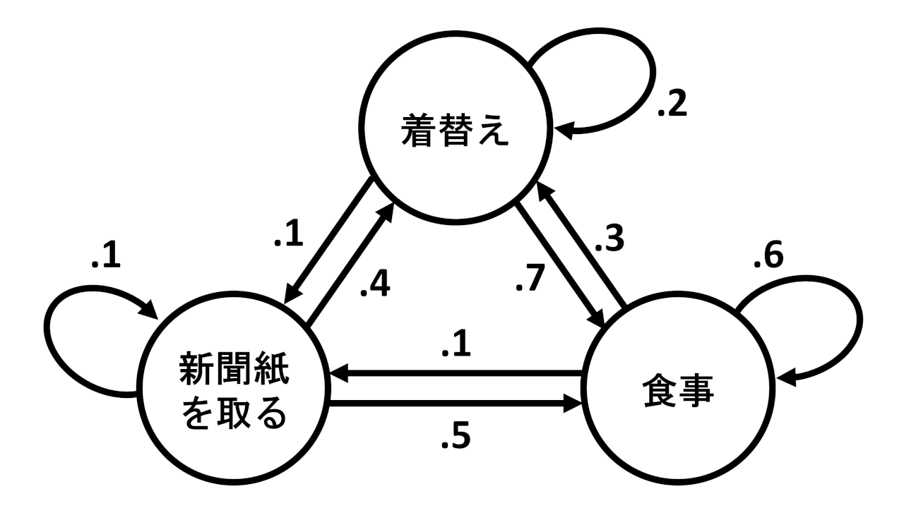
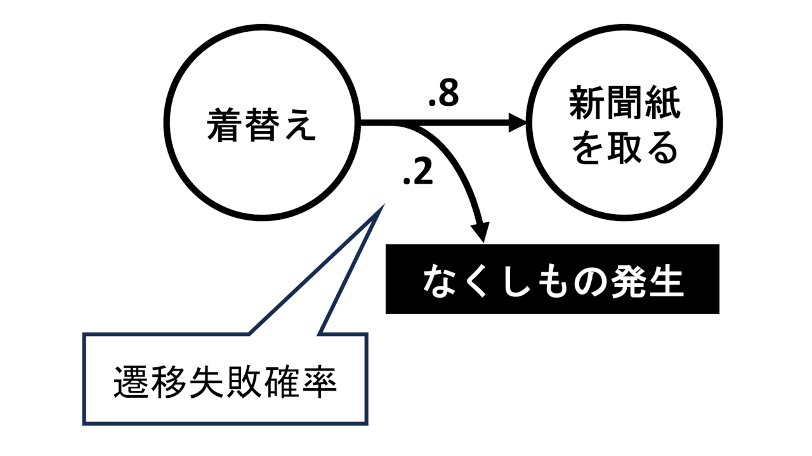
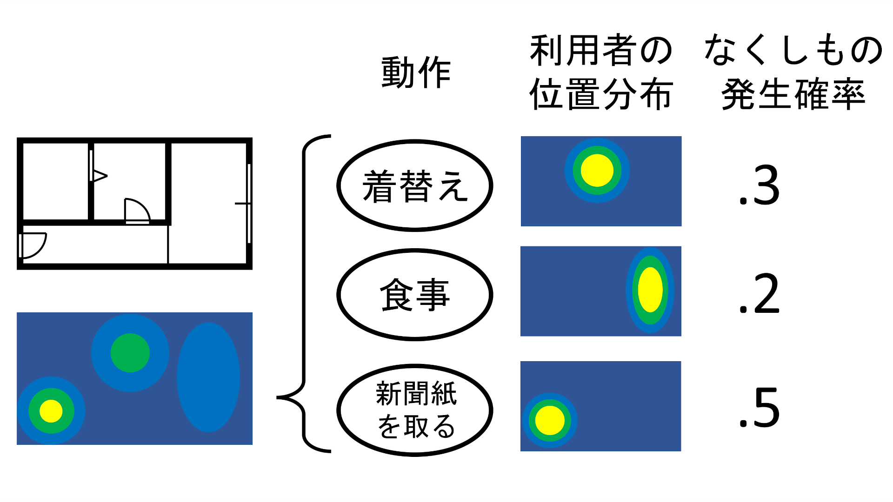

# WiLI

## 概要
WiLIはなくしもの位置推定用のプログラム群です。
名前はWhere is a Lost Itemの頭文字から取りました。 
本リポジトリはWiLIについての資料です。

## 理論
経験則をもとに利用者の行動を確率論的にモデル化することでなくしもの位置の確率分布を計算します。

### なくしもの位置の推定方法
経験則として、なくしものはある動作から別の動作に遷移する際に手に持っていたものを置くという場合に発生しやすいです。
例えば郵便受けから新聞紙を取ろうとスマホを床に置きそのまま忘れる等です。（筆者の実体験）

この経験則を以下のようにモデル化します。

* 仮定1：利用者は動作をノードとするマルコフ連鎖に従い行動
* 仮定2：なくしものはある動作から別の動作に遷移するタイミングで確率的に発生
  * 確率は遷移先の動作のみに依存
  * この確率を<b>遷移失敗確率</b>と呼ぶ

この仮定のもとでは、遷移を繰り返すことでいつかはなくしものが発生します。加えてなくしものが発生した際の遷移先を次の式で確率的に求めることができます。

$`
\mathbf{p} = \mathbf{L} (\mathbf{I} - \mathbf{K})^{-1} \mathbf{s}
`$

|記号|概要|
|:-:|:-|
|$`n`$|動作の数|
|$`p_i`$|$`i`$番目の動作へ遷移する際になくしものが発生する確率|
|$`\mathbf{p}`$|$`(p_1\ p_2\ \cdots\ p_n)^\mathrm{T}`$|
|$`\theta_i`$|$`i`$番目の動作へ遷移する際の遷移失敗確率|
|$`a_{i j}`$|$`i`$番目の動作から$`j`$番目の動作への遷移確率|
|$`\mathbf{L}`$|$`\begin{pmatrix} 0 & \theta_1 a_{12} & \cdots & \theta_1 a_{1n} \\ \theta_2 a_{2 1} & 0 & & \theta_2 a_{2n} \\ \vdots & & \ddots & \vdots \\ \theta_n a_{n1} & \theta_n a_{n2} & \cdots & 0 \end{pmatrix}`$|
|$`\mathbf{I}`$|$`n`$行$`n`$列の単位行列|
|$`\mathbf{A}`$|遷移確率行列|
|$`\mathbf{K}`$|$`\mathbf{A} - \mathbf{L}`$|
|$`s_i`$|最初の動作が$`i`$番目の動作である確率|
|$`\mathbf{s}`$|$`(s_1\ s_2\ \cdots\ s_n)^\mathrm{T}`$|

$`p_i`$を$`i`$番目の動作の<b>なくしもの発生確率</b>と呼ぶことにします。

ここで各動作ごとに利用者がいる位置の傾向を表す分布を用意します。
これらの位置分布のなくしもの発生確率を重みとした加重和をなくしもの位置の確率分布とみなします。

### 各種パラメータの学習方法
推定に用いるパラメータは以下の3種です。

1. 遷移確率
1. 遷移失敗確率
1. 利用者の位置分布

このうち遷移確率と利用者の位置分布は2種合わせると連続型の隠れマルコフモデル(以下HMM)に類似しています。そのため位置分布を正規分布に限定してしまうことでHMMの理論を適用でき、利用者の位置推移からパラメータの学習ができると考えています。

また遷移失敗確率はベイズ推定により学習します。真のなくしもの位置に対し次の式で遷移失敗確率の分布を更新します。

$`
f(\mathbf{\theta} | \mathbf{x}_\mathrm{true}) \propto h(\mathbf{x}_\mathrm{true}|\mathbf{\theta}) f(\mathbf{\theta})
`$

|記号|概要|
|:-:|:-|
|$`\mathbf{\theta}`$|$`(\theta_1\ \theta_2\ \cdots\ \theta_n)^\mathrm{T}`$|
|$`f(\mathbf{\theta})`$|遷移失敗確率の確率分布の密度関数|
|$`\mathbf{x}_\mathrm{true}`$|真のなくしもの位置|
|$`h(\mathbf{x})`$|なくしもの位置の確率分布の密度関数|

備考：大雑把に言うと$`h(\mathbf{x} | \mathbf{\theta})`$は遷移失敗確率が$`\mathbf{\theta}`$のときの推定結果のことであり、遷移失敗確率の更新には尤度として「推定結果が真のなくしもの位置をどれだけ正確に予測できたか」を用いるということです。

## プログラム群
### 作成中
* wilitools
  * https://github.com/MaruKazeMaru/wilitools
  * Pythonパッケージ
  * なくしもの位置推定
  * 遷移失敗確率の学習
  * 各種パラメータのDBへの保存
* wili_web
  * https://github.com/MaruKazeMaru/wili_web
  * Flaskを用いたwebアプリケーション
  * wilitoolsの各機能をブラウザから利用

### 今後作成
* 利用者の位置推移から遷移確率&利用者位置分布を学習するプログラム
* 利用者の位置推移を監視するシステム

## 著作権について

wili_documents by Shinagawa Kazemaru is licensed under <a href="http://creativecommons.org/licenses/by/4.0/?ref=chooser-v1" target="_blank" rel="license noopener noreferrer" style="display:inline-block;">CC BY 4.0</a>

